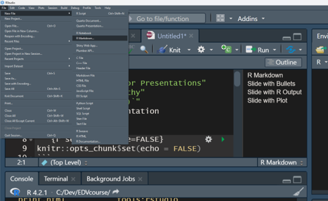

```{r setup, include=FALSE}
knitr::opts_chunk$set(echo = FALSE)
```

## Create a new R Markdown Presentation

Go to the *File* menu at the top left of RStudio, choose *New File*, then select *R Markdown...*



## Choose a *slidy* Presentation Template

Select a *Presentation* from the list on the left slide.

Fill in the title, author, and date.

Pick a *Slidy* or *ioslides* presentation. *ioslides* is a bit simpler, and *Slidy* has more options for customization. Most output features are identical.


## R Markdown

This is an R Markdown presentation. Markdown is a simple formatting syntax for authoring HTML, PDF, and MS Word documents. For more details on using R Markdown see <http://rmarkdown.rstudio.com>.

When you click the **Knit** button a document will be generated that includes both content as well as the output of any embedded R code chunks within the document.

## Slide with Bullets

-   Bullet 1
-   Bullet 2
-   Bullet 3

## Slide with R Output

```{r cars, echo = TRUE}
summary(cars)
```

## Slide with Plot

```{r pressure}
plot(pressure)
```

## Slide with Methane Plot from Web Data

```{r methane, message = FALSE, warning = FALSE}
library(tidyverse)
URL.MLO.CH4 <- file.path( 'https://gml.noaa.gov/aftp/data/trace_gases/ch4/flask/surface/txt/ch4_mlo_surface-flask_1_ccgg_month.txt')
MLO.CH4 <- read_table(URL.MLO.CH4, skip = 71)
headers <- c('site', 'year', 'month', 'value')
colnames(MLO.CH4) <- headers

MLO.CH4 %>% 
  mutate(decimal.Date = (year + month/12)) %>% 
  ggplot(aes(x = decimal.Date, y = value)) +
  geom_point() +
  geom_line(alpha = 0.6) +
  geom_smooth() +
  theme_bw() +
  labs(x = 'Year', y = 'Methane concentration (ppb)',
       title = 'Mauna Loa - Methane trend')
```

## Interactive Methane Plot

You will need to `install.packages('plotly')` to run this code.

```{r interactive, message = FALSE, warning = FALSE}
library(plotly)

ggplotly(MLO.CH4 %>% 
  mutate(decimal.Date = (year + month/12)) %>% 
  ggplot(aes(x = decimal.Date, y = value)) +
  geom_point() +
  geom_line(alpha = 0.6) +
  geom_smooth() +
  theme_bw() +
  labs(x = 'Year', y = 'Methane concentration (ppb)',
       title = 'Mauna Loa - Methane trend'))
```

## Maps

Maps work as usual, mostly.  The +/- changes slides.  

```{r SoCalEJ, message = FALSE, warning = FALSE}
library(sf)
library(leaflet)

URL.path <- 'https://raw.githubusercontent.com/RadicalResearchLLC/EDVcourse/main/CalEJ4/CalEJ.geoJSON'
SoCalEJ <- st_read(URL.path) %>% 
  st_transform("+proj=longlat +ellps=WGS84 +datum=WGS84")

palDPM <- colorNumeric(palette = 'YlOrBr', domain = SoCalEJ$DieselPM_P)

leaflet(data = SoCalEJ) %>% 
  addTiles() %>% 
  setView(lat = 33.8, lng = -117.60, zoom = 9) %>% 
  addPolygons(stroke = FALSE,
              fillColor = ~palDPM(DieselPM_P),
              fillOpacity = 0.5) %>% 
  addLegend(pal = palDPM, 
            title = 'Diesel PM (%)', 
            values = ~DieselPM_P)
```
